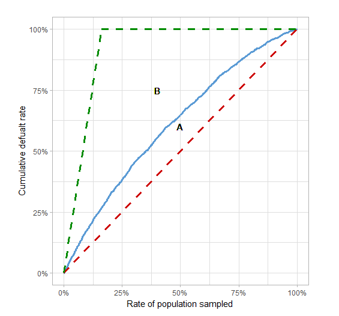
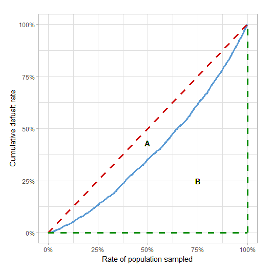

# Gini coefficient
Gini Coefficient, a.k.a. Somers' D, is a common metric used in determine a credit risk model discriminatory power between good and bad borrowers.

This is not to be mistaken as the Gini's measure of inequality, a.k.a. Corrado Gini, which measure the ratio of areas under the Lorenz curve. (not the focus of this doc)

There are three ways to calculate Gini coefficient

## 1. CAP Curve
Gini coefficient is the summary of the Cumulative Accuracy Profile (CAP) curve.

The CAP curve is captures the ordinal relation between score (PD) and default rate.

If our model does a good job discriminating good and bad borrowers, we would expect to find more defaults at borrowers with low scores than borrowers with high scores.

The CAP curve captures this notion by aggregating the cummulative default rate when sampling borrowers from the lowest score to the highest

To plot the CAP Curve, the model's population needs to be ordered by the predicted likelihood of default.

The x-axis of the CAP curve represents the portion of the poulation sampled, and the y-axis represents the corresponding cummulative default rate.

  

$$\frac{A}{A + B} = \frac{0.109}{0.419} = 0.26$$

## 2. Lorenz Curve
The Lorenz curve is the inverse of the CAP curve; it is constructed using the same mechanism of sampling observations and aggregating the cumulative default rate, but the sampling is done in reverse order (from highest to lowest score).

The Lorenz also has a diagonal line, which is equivalent to the ‘CAP random model’ line and is called “the Line of Equality” (the red line in the chart below).

  

$$ Gini = \frac{Corrado Gini}{1 - default rate} $$

$$ Corrdo Gini = \frac{A}{A + B} = \frac{0.109}{0.5} = 0.22$$

$$ default rate = 0.16 $$

$$ Gini = \frac{0.22}{1-0.16} = 0.26$

## 3. ROC Curve (Recommended)

$$ Gini = 2 * AUC - 1 $$

# Drawbacks and pitfalls of the Gini Coefficient
## 1. Identitcal scores
To avoid this problem, derive gini coefficient using ROC AUC method

## 2. Ordinal Metric
Ordinal metrics are metrics which captures the order of values while ignoring the distance between them. 

This characteristic of the Gini coefficient can soetimes mask poor model performances

This makes it a poor metric as it doesn't capture the model's sensitivity to different risk levels.

Solution: Plots the score distribution of the good and bad borrowers.
